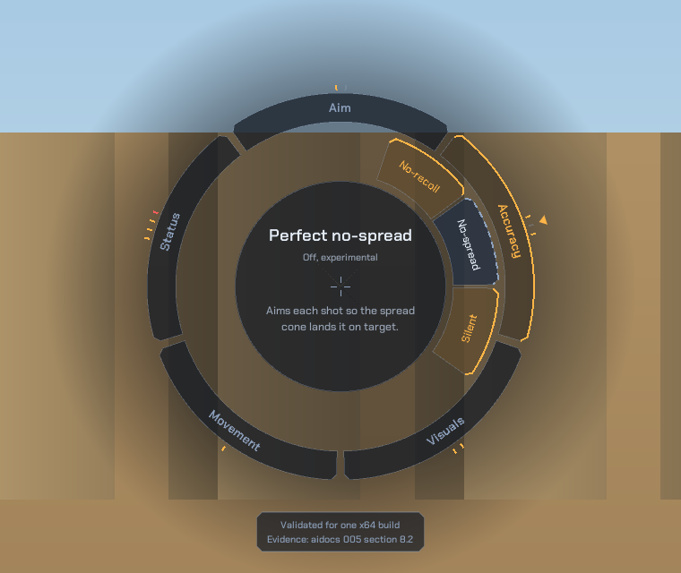
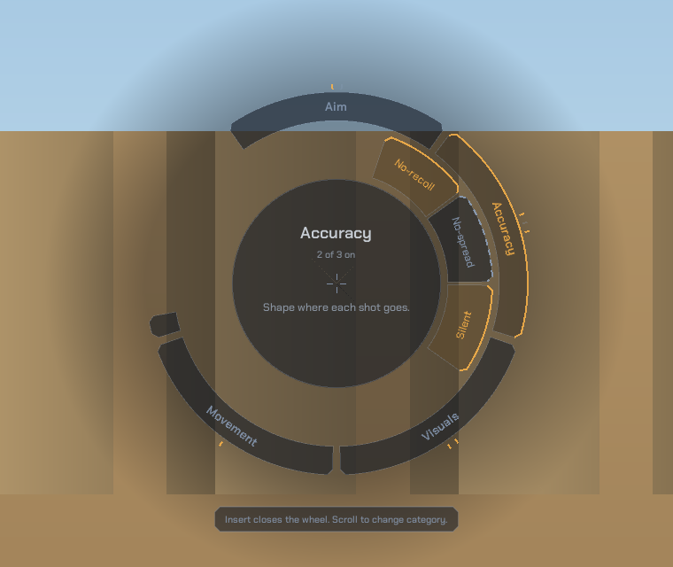
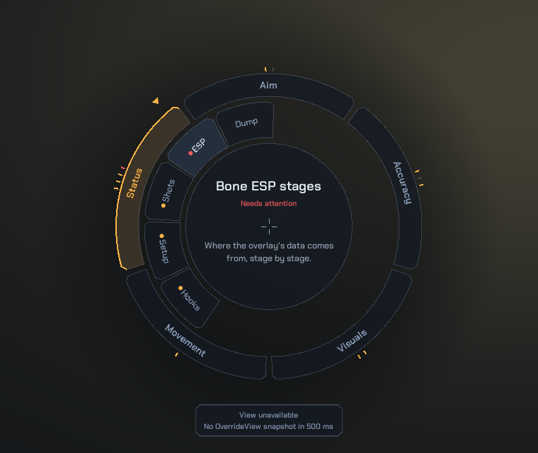

# 007 - A weapon-wheel menu

The menu is a radial "weapon wheel" around the crosshair: categories on an
outer ring, the selected category's items fanned out on an inner ring, and a
readout in the middle that explains whatever the pointer is on. It also shows
live status for each part of the DLL. This chapter covers its design, the ImGui
drawing techniques behind it, and two overlay lifecycle rules that any D3D9
ImGui overlay needs.

Use this only with binaries and processes you are permitted to study,
preferably in an offline or local test environment.



The screenshots in this chapter come from the offline preview in section 8, not
from the game.

## 1. Design decisions

### 1.1 Why a wheel

A wheel is native to the genre: players already know that a direction picks a
segment and the center describes it. Around the crosshair, it also keeps the
point you aim at visible, which a window over the middle of the screen does
not. The cost is room. A wheel holds fewer, shorter labels than a list, so the
fixed text lives in `ui/menu_content.cpp` and every label is written to fit a
ring segment. The full name and explanation appear in the readout.

### 1.2 Structure

| Element | What it shows |
| --- | --- |
| Outer ring | Five categories: Aim, Accuracy, Visuals, Movement, Status |
| Tick marks outside the outer ring | One per toggle or status item in that category, amber when on (or working), red when failing |
| Inner ring | The selected category's items, fanned out toward it |
| Center readout | Name, state, and a one-sentence summary of what the pointer is on |
| Caption below the wheel | For an item, its evidence (the aidocs section) or live status details; for a category, the controls |
| Amber caret on the rim | The pointer's direction, like a weapon-wheel needle |

Every visual device encodes something:

- **amber** means on, working, or selected; it is the color of the CS:S HUD
  numerals, so it reads as part of the game rather than as decoration;
- **red** means a stage failed and the feature is failing closed;
- a **dashed outer edge** marks an experimental item (perfect no-spread, Bone
  ESP);
- a **status dot** in front of a Status label shows that item's state.

### 1.3 Tokens

| Token | Value | Role |
| --- | --- | --- |
| `kGlass` | `#141A24` at 70% | Segment fill, readable over bright and dark maps |
| `kGlassRaised` | `#263142` at 84% | Hovered segment |
| `kSteel` | `#8FA3BF` | Idle labels, hairlines at 28% |
| `kAmber` | `#FFB547` | On, selected, the caret |
| `kFault` | `#FF5D5D` | Failing stages |
| `kText` / `kTextDim` | `#E6EEF8` / `#9AA7B8` | Readout title and body |

The typeface is Chakra Petch, one family at four sizes on a traditional scale:
14 (captions, state), 16 (item labels, summary), 18 SemiBold (categories), and
24 SemiBold (readout title). Its angular cuts match the chamfered segment ends.
ImGui's built-in Proggy font would work, but it reads as a debug tool.

### 1.4 Motion

There is one orchestrated moment: the rings sweep open over 160 ms, clockwise
from the first category. Changing category fans the new items out over 120 ms,
and the caret follows the pointer. Nothing moves on its own while the wheel is
idle.



## 2. Layering

| Layer | Files | Rule |
| --- | --- | --- |
| Pure UI | `ui/wheel_geometry.*`, `ui/wheel.*`, `ui/theme.*`, `ui/menu_content.*`, `ui/fonts/` | ImGui only; no game headers, no hooks, no config |
| Feature | `features/menu.cpp`, `features/telemetry.*` | Builds the model from `Config` and telemetry, applies clicks |
| Hooks | `hooks/end_scene.cpp` and the other hooks | Call the menu, count calls, publish state |

The pure layer is what makes the wheel testable without the game. The geometry
has unit tests (`tests/wheel_tests.cpp`), and the offline preview in section 8
renders the real wheel code with sample data.

`WheelModel` is plain data: categories, items, and each item's label, title,
summary, details, kind (toggle, status, or action), state, and experimental
flag. `ui/menu_content.cpp` writes the fixed text once. Each frame,
`features/menu.cpp` copies it, fills in live state, draws, and maps a click
back to a `Config` toggle or an action through a stable `ui::MenuItem` id.

## 3. Polar geometry

`ui/wheel_geometry.cpp` is the only math in the wheel. Screen space grows
downward, so angles grow clockwise and the top of the wheel is `-pi/2`.

- **Categories** split the full circle equally. Category `i` of `n` is centered
  at `-pi/2 + i * 2pi/n`, with a small gap removed from each side.
- **Items** fan out around the selected category's middle angle. Each item gets
  36 degrees, and the fan never exceeds 150 degrees, so five Status items share
  150 degrees instead of taking 180.
- **Wrap-around** is the classic polar bug. A sector can straddle the `-pi`/`pi`
  seam (the left side of the wheel). `AngleInSector` measures the pointer's
  angle from the sector start, wrapped into `[0, 2pi)`, and compares it with the
  sector width, so the seam never matters.

`HitTest` turns a pointer offset into a band (center, items, categories, or
none) and a segment index: the radius picks the band, and the angle picks the
segment. Gaps between segments and the space between rings return none, so a
click there does nothing. The tests cover the center, a category at the top, a
point exactly on a category boundary, an item on the selected side, the empty
side of the inner ring, the band gaps, and a fan that crosses the seam.

## 4. Drawing with ImGui

Everything is drawn into one draw list with ImGui's public primitives.

### 4.1 Segments

Each segment is built once as a `Band`: matching inner and outer edge points,
with the outer corners cut at 45 degrees (`kChamfer`, 6 px). Fill, outline, and
edge all use those same points, so they always agree:

- **fill** is a single triangle strip written with `PrimReserve`/`PrimWriteVtx`.
  Drawing a segment as many anti-aliased `AddQuadFilled` slices would put a
  faint seam between every slice, because each quad fades out its own edges;
- **outline** is one closed `AddPolyline` around the band, which also smooths
  the strip's hard edges;
- **edge** strokes only the outer points: amber for on or selected, dashed for
  experimental.

### 4.2 Text along the rings

Labels run along their ring, like an engraved lens bezel. `RingText` draws
normal horizontal text centered on the label's anchor point, then rotates the
vertices it just added around that point by the ring tangent (`angle + pi/2`).
In the lower half of the wheel it rotates by a further half turn, so no label
reads upside down. Straight text on a ring is a good approximation here: a
70 px label on a 200 px radius deviates from the arc by about 3 px.

Tangent text is what makes labels fit. The side segments are tall and narrow,
so a horizontal "No-spread" overflows them. Running along the ring, it fits in
the segment's arc length.

### 4.3 Reveal clipping

The opening sweep and the category fan clip each segment against a growing arc.
`Revealed(sector, origin, sweep)` measures the sector start from the sweep
origin, wrapped into `[0, 2pi)`, and keeps only the part already covered.

Completion needs a special case. When the wheel is fully open, `sweep` is
exactly `2pi`, yet a segment that crosses the sweep origin, such as the Status
fan's "ESP" item, still measures part of itself as beyond the sweep. Clipped,
it would lose its end and its label. `Revealed` therefore returns the whole
sector once the sweep is complete.

### 4.4 Vignette

A soft darkening behind the wheel separates it from bright maps, the way game
weapon wheels dim the scene. Two simpler approaches fail:

- **concentric filled circles** show visible bands on the sky;
- **a filled disc plus a gradient ring** leaves a hairline where the disc's
  anti-aliasing fringe overlaps the ring. The open wheel hides it, but it shows
  during the sweep.

The vignette is one mesh instead: a center vertex, a rim at the category ring's
outer radius, and an outer edge at `kVignetteRadius` with zero alpha. The GPU
interpolates the alpha per vertex, so there are no bands and no seam.

### 4.5 Fonts

Chakra Petch is licensed under the SIL Open Font License 1.1, which allows
embedding it in the DLL as long as the license travels with it
(`ui/fonts/OFL.txt`). The two weights are compressed and base85-encoded with
ImGui's own `misc/fonts/binary_to_compressed_c -base85` from the same release,
and added at startup with `AddFontFromMemoryCompressedBase85TTF`. Each weight is
about 66 KB of source. MSVC concatenates the generated string pieces into one
literal, which must stay under its 65,535-byte limit; each font is about
62,600 bytes.

### 4.6 Windows name collisions

Some natural helper names compile on Linux and fail under MSVC. `DrawText` is
a `winuser.h` macro, which becomes `DrawTextA`, and `near` and `far` are
`windef.h` macros. The wheel's helpers are named `PutText`, `start`, and `end`
for that reason. Pick names that avoid Win32 macros in any file that can see
`Windows.h`.

## 5. Input

The wheel is drawn inside an invisible full-screen ImGui window
(`NoDecoration | NoBackground | NoMove | NoSavedSettings |
NoBringToFrontOnFocus | NoNav`). The window lets ImGui own the mouse while the
menu is open, and `IsWindowHovered` gates clicks and scrolling. The drawing
itself uses the polar hit test, not ImGui widgets.

- **Insert** opens and closes the wheel.
- **Clicking a category** selects it; **scrolling** steps through the
  categories.
- **Clicking an item** toggles it, or runs it if it is an action. Status items
  are read-only.

The `VGUI_Surface030::LockCursor` hook from chapter 004 section 6.3 keeps the
engine from recentering the mouse while the menu is open.

While the menu is open, the window procedure hook also swallows mouse buttons,
`WM_MOUSEWHEEL`, `WM_INPUT`, and key messages. That keeps a click or a scroll
in the wheel away from the game, because the game reads this input only from
window messages. In the x64 `inputsystem.dll`:

- `CInputSystem::AttachToWindow` (`inputsystem.dll+0x1DB0`) subclasses the game
  window with `SetWindowLongPtrW`;
- its window procedure (`+0x3930`) turns `WM_LBUTTONDOWN` through
  `WM_XBUTTONDBLCLK` into button events, and `WM_MOUSEWHEEL` into a press and
  release of the wheel-up or wheel-down button;
- mouse movement arrives as `WM_INPUT`, read with `GetRawInputData`, which the
  module resolves at runtime instead of importing.

Our procedure is installed later, so it sees every message first. No game
module polls the mouse: the only `GetAsyncKeyState` use is a debug pause loop
in `engine.dll` (`+0x211BC0`) that reads the R, Q, and S keys.

The DLL's own features are another matter. Bunny hop, the triggerbot, and the
aimbot read Space, Shift, and the left button with `GetAsyncKeyState`, which
reports the physical key whatever the window procedure does. `CreateMove`
therefore skips all three while the menu is open.

`features::Menu` treats a gap of more than 100 ms between two drawn frames as a
reopen and replays the sweep.

## 6. Live status

The Status category replaces a trip to the console for the most common
questions. It reads `features/telemetry`, which keeps the data each hook
publishes safe to read from any thread:

| Item | Source | Working when |
| --- | --- | --- |
| Hooks | atomic call counters, sampled once a second | `CreateMove` ran in the last second |
| Setup | a startup record written once by `MainThread` | EngineTrace, RenderView, and ModelInfo resolved |
| Shots | a mutex-protected copy of the last `ShotAngleTrace` | every requested stage applied |
| ESP | `GetBoneEspDiagnostics()` | viewport, view, and matrix ready, and at least one skeleton resolved whenever there are enemies to draw |
| Dump | an atomic request flag | an action: the next real command prints the F1 report |

Two rules shaped this module:

- **The render thread never resolves anything.** "Setup" shows a record made at
  startup instead of calling the interface getters from `EndScene`. A getter
  whose first lookup failed retries it and prints a console line on every call,
  and the getters' cached pointers are not synchronized across threads.
- **The dump runs on the game thread.** Clicking "Dump" only sets a flag;
  `CreateMove` consumes it on the next real command, where the weapon reads in
  `PrintDebugInfo` are safe. That is the same deferral F1 uses for
  zero-sequence commands.



## 7. Overlay lifecycle

### 7.1 Device reset

ImGui's DX9 backend creates its vertex buffer, index buffer, and font texture in
`D3DPOOL_DEFAULT`. `IDirect3DDevice9::Reset` fails while any `D3DPOOL_DEFAULT`
resource exists. If nothing releases ImGui's resources first, a reset with the
overlay loaded can leave the game unable to recover its device.

The x64 `shaderapidx9.dll` shows which device the game creates and when it
resets it:

| Step | Function | Evidence |
| --- | --- | --- |
| Factory | `shaderapidx9.dll+0x29860` | loads `d3d9.dll` and calls `Direct3DCreate9Ex(32)`, keeping it unless `-nod3d9ex` is set or `-dxlevel` is below 90; otherwise `Direct3DCreate9(32)` |
| Device | `+0x2A6F0` | factory slot 16, `CreateDevice`, on that factory; never `CreateDeviceEx` |
| Present | `+0x2AB90` | device slots 42 (`EndScene`) and 17 (`Present`); `D3DERR_DEVICELOST` from `Present` marks the device lost |
| Reset | `+0x28430` | device slot 16 (`Reset`) to recover a lost device or to resize the window, each after the game's own `ReleaseResources` (`+0x2B140`) |

No code in the module calls `ResetEx` (slot 132) on the device, so the DLL
hooks only `Reset`. Without launch options the game takes the D3D9Ex path.
`mat_supports_d3d9ex` does not choose it: it is a hidden ConVar (default `0`)
that the factory function sets to `1` whenever `Direct3DCreate9Ex` succeeds.

On the D3D9Ex path the steady-state check skips `TestCooperativeLevel`, so a
reset starts from a window resize, or from a `D3DERR_DEVICELOST` returned by
`Present`. Microsoft documents that D3D9Ex devices are not lost on ordinary
focus changes, so alt-tab probably resets only on the plain D3D9 path. A
resolution or window-size change is the reliable way to exercise the hook.

The hooked `Reset` and `EndScene` come from a dummy device made with
`Direct3DCreate9`, while the game's device comes from the D3D9Ex factory.
Startup therefore also builds a throwaway device the way the game does
(`GetExFactorySlots`) and logs whether its `Reset` and `EndScene` entries are
the hooked ones. The `EndScene` hook worked in the x64 smoke test, and the
saved launch options do not disable D3D9Ex, so the entries are probably shared.
The log settles it.

`hkReset` calls `ImGui_ImplDX9_InvalidateDeviceObjects` and then the original.
Recreating the objects needs no code: ImGui's `NewFrame` rebuilds the font
texture when it is missing, and the render call rebuilds the buffers.

### 7.2 Settings file and draw order

- `io.IniFilename` is null. ImGui's default `imgui.ini` path is relative, so
  it would be written into the game's working directory, and the wheel has no
  window layout worth saving.
- Bone ESP draws on ImGui's background draw list, beneath every window, so the
  skeleton appears under the wheel instead of across it. Chapter 006 section 8
  describes the draw order.

## 8. Offline preview

`tools/wheel_preview` renders the real wheel code to PNG files, without the
game or a GPU, so the design can be reviewed from screenshots:

1. It sets up an ImGui context at 1920x1080 and loads the same fonts and theme.
2. It fills `ui::BuildMenuContent()` with sample states.
3. For each scene, it sets the time and pointer and calls `ui::DrawWheel`.
4. `raster.cpp` renders ImGui's draw data in software: textured, vertex-colored
   triangles, alpha-blended and clipped, the way the DX9 backend draws them.
   Two triangles that share an edge must not both blend the pixels on it, or
   the translucent strips would show false seams. Each edge is owned by exactly
   one of the two triangles, decided by the direction they traverse it in.
5. `stb_image_write` (public domain) saves a crop around the wheel.

The scenes cover the opening sweep, an experimental item hovered on a bright
map, a failing status item on a dark map, and a hovered category. On Windows,
it builds with the tests (`BUILD_TESTING`, target `wheel_preview`). The main
CMake project needs the DirectX SDK, so on Linux build it directly; it takes
the output directory as its only argument:

```sh
g++ -std=c++17 -O2 -Iimgui -INikooo777 -Itools/wheel_preview \
    imgui/imgui.cpp imgui/imgui_draw.cpp imgui/imgui_tables.cpp \
    imgui/imgui_widgets.cpp Nikooo777/ui/*.cpp tools/wheel_preview/*.cpp \
    -o wheel_preview && ./wheel_preview previews
```

Each pitfall in section 4 is visible in these renders, so render the scenes
after any drawing change.

## 9. Status

Verified:

- the polar geometry, through `tests/wheel_tests.cpp`;
- the drawing, through preview screenshots of every scene;
- statically, in the 2026-09-20 x64 binaries, the game's input path
  (section 5) and its device creation and reset calls (section 7.1).

Not verified yet, and needed before relying on it:

- an MSVC build of the DLL (the wheel code has only been compiled with GCC);
- clicking, scrolling, and toggling in the game;
- a device reset with the overlay loaded (a resolution or window-size change),
  and the startup line that reports whether the D3D9Ex factory device shares
  the hooked `Reset` and `EndScene`;
- display scaling: the wheel is designed at 1080p in fixed pixels, so at 4K it
  is small and at 720p it is large.

## 10. Adding an item

1. Add an id to `ui::MenuItem` and its text to `BuildMenuContent`. Keep the
   label short enough for a ring segment, and put the full name in the title.
2. For a toggle, map the id to its `Config` field in `ToggleFor`
   (`features/menu.cpp`). For a status item, fill its state and details in
   `BuildModel` from telemetry, never from a resolver.
3. Render the preview and look at the new segment before building the DLL.
